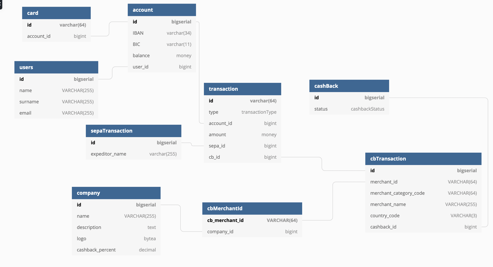

# api_bank
Bank api sandbox

## dir 
- data/ => some json to generate db values...
- db/ => contain the schema use by postgres
- scripts/ => scripts use by npm
- src/ => typescript source code for this project

## step1 and step2

You can find the database schema in the db directory.

It should like to something like that : 



## step3

You can setup a env running : 

```npm run init_env```

after that you can serve solution using : 

```npm run serve```

after that you can send some transaction using the following commands : 

```npm run transaction data/transaction1.json```

## step 4

you need a server running. you can test it using

```npm run list_transac 1```

where 1 is the user_id

## step 5

you need a server running. you can test it using

```npm run stats```

##env var

if you want some debug use SQL_DEBUG=1 as env var.
